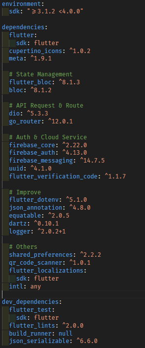

# Order Ease App


---

## 作品介紹

### 簡介

我與另一名前端工程師合作並設計並開發的一款餐廳點餐系統，分為 **商店管理系統（Store Ease 商店輕鬆理）** 與 **快速點餐系統（Order Ease 餐點輕鬆訂）** 兩部份；而這個 Project 是提供給客戶端使用的 **快速點餐系統（Order Ease 餐點輕鬆訂）**。

:bell:
**想了解整個餐廳點餐系統的後端，可參考我的另外一個 Repository -> [Ordering System Backend](https://github.com/phzeng0726/ordering-system-backend)**

- **餐點輕鬆訂**
  - 功能特色：
    - 帳戶管理： 可以 E-Mail 實名或匿名註冊，並於後續更改使用者資訊或刪除用戶
    - 快速點餐： 掃描商店生成的 QRCode，即時獲取商店菜單並快速點餐。
    - 訂單即時更新： 透過 FCM，在商店有任何訂單狀態更新時及時回饋給客戶。
    - 訂單紀錄： 紀錄所有的訂單歷史
  - 未來展望： 整合理財系統，實現預算控管與視覺化呈現。也可將訂單歷史的商家地理位置做成地圖，讓點餐也能紀錄用戶的行徑軌跡，增添趣味性。

### 開發時長

- 與製作商店管理系統的前端工程師合作與溝通，從無到建立，開發總時長**為 1.5 週**。

在執行專案之前，先於 Flutter 的專案路徑:file_folder: `app`執行：

```
flutter gen-l10n
```

## Demo 影片

[](https://www.youtube.com/watch?v=ILitfBOQzME)

## 負責項目

- 所有的後端事項
- App 製作
  - Firebase Auth 匿名註冊
  - 新增/讀取/編輯/刪除 記名**用戶**資訊（搭配 Firebase Auth）
  - 掃描商店管理系統提供的 QR Code ，獲取菜單並進行點餐
  - 新增 訂單
  - 讀取 歷史訂單清單
  - 串接 Firebase Cloud Messaging (FCM)，即時發送與回傳**訂單狀態資訊**
  - 多國語系設置

## 技術清單

- **Frontend**

  - Flutter `v3.13.9`

    - **Design pattern**
      - Model–view–controller(MVC)
    - **Main Dependencies**
      - Bloc (State Management)
      - dio (API Router)
      - go_router (Page Router)
      - dartz & json_annotation (Enhance the application build process and error handling)
    - **All Dependencies**

      

- **Cloud Services**
  - Firebase Auth
  - Firebase Cloud Messaging (FCM)
- **Other Tools**
  - **Git** (Version control)
  - **Postman** (API tool)
  - **Trello** (Scrum pattern)
